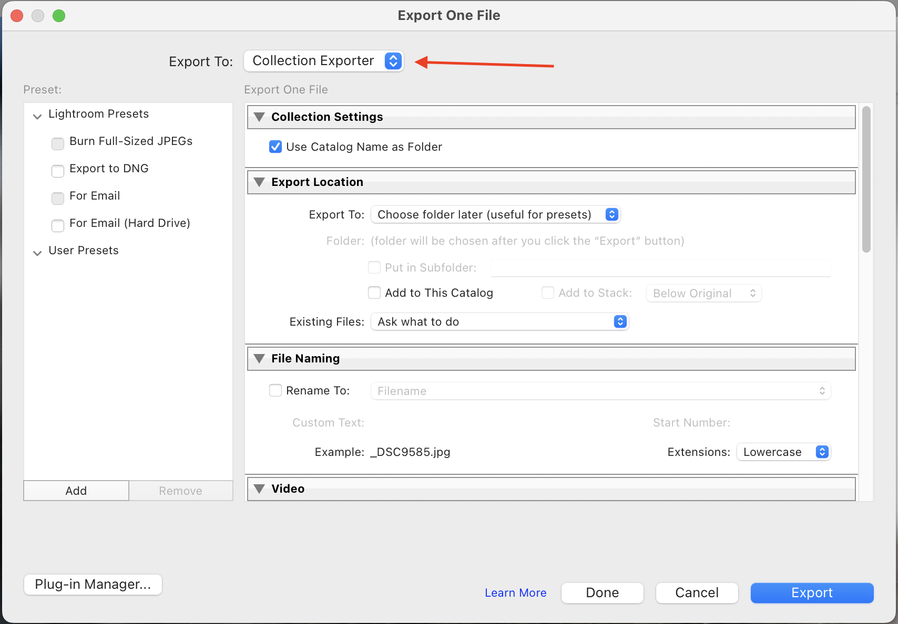

<br>
<div >
<div align="center">
  <a href="https://github.com/apoloa/collectionexporter.lrplugin">
    
  </a>

  <h3 align="center">Collection Exporter Lightroom Classic Plugin</h3>
</div>

<details>
  <summary>Table of Contents</summary>
  <ol>
    <li>
      <a href="#about-the-project">About The Project</a>
      <ul>
        <li><a href="#build-with">Build With</a></li>
      </ul>
    </li>
  </ol>
  <ol>
    <li>
      <a href="#intallation">Installation</a>
    </li>
  </ol>
</details>

## About The Project

This Lightroom plugin allows you to export photos to folders named after their original locattion. It automates the process of maintaining the folder structure during the export. 

In my case the folder structure is generated by the [sd_importer](https://github.com/apoloa/sd_importer) that follows:
```
- 2021
    - 2018-08-31 - NY Trip - Intrepid Museum
        - _RX05023.ARW
        - _RX05024.ARW
        - _RX05025.ARW
    - 2018-09-01 - NY Trip - Yankees Stadium
        - _RX06003.ARW
        - _RX06004.ARW
        - _RX06006.ARW
```

To export these two collections from Lightroom, I need to do it in two steps, copying the folder path into the export dialog from Lightroom in order to export these images.

Using this plugin, you only need to select the base folder where you want to export, and the plugin will create the required collection folder.
```
- Users
    - Images
        - Outputs  
            - 2018-08-31 - NY Trip - Intrepid Museum
                - _RX05023.jpg
                - _RX05024.jpg
                - _RX05025.jpg
            - 2018-09-01 - NY Trip - Yankees Stadium
                - _RX06003.jpg
                - _RX06004.jpg
                - _RX06006.jpg
```


### Build with

* [![Lua][Lua]][Lua-url]

## Installation

1. Download the Plugin:
    * Download the `CollectionExporter.lrplugin` folder from the repository. You can clone the repository or click in the download button:
    <div align="center">
      <a href="https://github.com/apoloa/collectionexporter.lrplugin/archive/refs/heads/main.zip">
        
      </a>
    </div>  

1. Install the Plugin in Lightroom:
    * Open Lightroom.
    * Go to `File` > `Plugin Manager`.
    * Click `Add`.
    * Navigate to the location where you downloaded the plugin and select the `CollectionExporter.lrplugin` folder.
    * Click `Add Plugin`.

## Usage
1. Select Photos:
   * In Lightroom, select the photos you want to export.
2. Export Photos:
   * Go to `File` > `Export`.
   * In the export dialog, select `Collection Exporter` in the `Export To` dropdown.
    
   * Configure any additional export settings as needed.
   * Click Export.
   * Enjoy


[Lua]: https://img.shields.io/badge/lua-000000?style=for-the-badge&logo=lua&logoColor=white
[Lua-url]: https://www.lua.org/